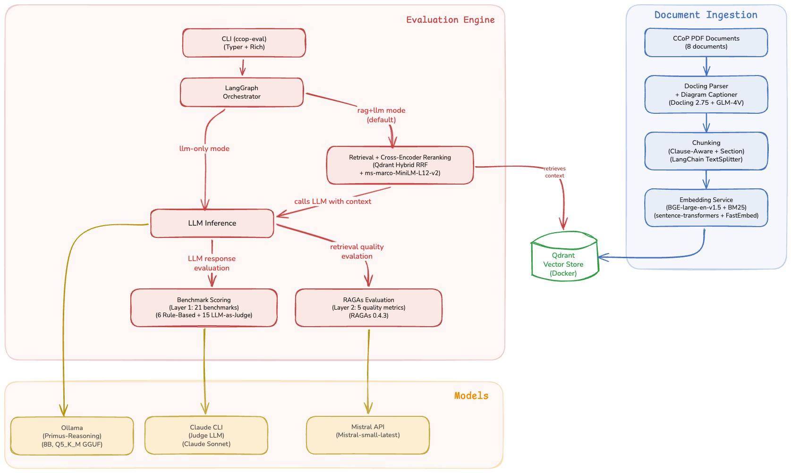

# Fine-Tuning LLM on Singapore's Cybersecurity Code of Practice (CCoP 2.0) Standards for Critical Information Infrastructure

**Mid-Term 2 Report**

**Project Period:** September 2025 - August 2026

**Author:** Sagar Pratap Singh

**Report Date:** March 2026

---

## Executive Summary

Term 1 baselined the untuned Primus-Reasoning model at 48.96% across 21 benchmarks — strong reasoning (61.6%) but severe factual grounding gaps (31.6%) with frequent hallucination of regulatory facts. Term 2's objective is to close this grounding gap through retrieval-augmented generation before proceeding to fine-tuning. A complete RAG pipeline was built — Qdrant hybrid search, clause-aware chunking of 8 CCoP documents, cross-encoder reranking, and diagram captioning — grounding the model in authoritative clause text. The evaluation engine was upgraded with dual-layer scoring (LLM-as-Judge + RAGAs metrics) and a CLI supporting three evaluation granularities. Early results show RAG-augmented responses citing specific CCoP clauses, while the unaugmented model substitutes from unrelated frameworks. Full batch evaluation is in progress; the RAG-vs-baseline delta will determine which domains require fine-tuning.

## 1. Recap of Term 1 Findings

The baseline evaluation of the untuned Llama-Primus-Reasoning model (8B parameters, 4-bit quantized) against CCoP 2.0 achieved a weighted score of 48.96% across 17 of 21 benchmarks, with 4 benchmarks (B7, B10, B14, B16) deferred for manual expert review. The model demonstrated strong logical reasoning capability (61.6% average across reasoning benchmarks) but exhibited severe deficiencies in Singapore-specific CCoP knowledge domains (31.6% average for factual grounding).

Three critical failure modes were identified:

1. **Hallucination of regulatory facts** (B21: 22.13%) — the model fabricates specific technical details such as password lengths, SIEM vendor requirements, and air-gap clauses that do not exist in CCoP 2.0.
2. **Regulatory scope confusion** — the model struggles to correctly determine CCoP applicability, CII designation boundaries, and IT versus OT classification.
3. **Factual grounding gaps** — when asked about specific CCoP requirements, the model produces plausible but inaccurate paraphrases rather than grounded responses traceable to authoritative clause text.

The ground truth dataset of 118 test cases across 21 benchmarks remains pending expert validation by a CCoP 2.0 compliance practitioner.

These findings indicated that fine-tuning alone is insufficient to address the factual and grounding deficiencies — the model needs access to authoritative CCoP clause text through retrieval-based grounding before fine-tuning can be effective.

## 2. Strategic Pivot: RAG-First Approach

The original project plan for Term 2 envisioned proceeding directly to comprehensive baseline benchmarking (Phase 3), a small fine-tuning test (Phase 4), and full dataset creation (Phase 5). However, the baseline results from Term 1 made clear that the model's core weakness is not reasoning ability — it is the absence of factual grounding in authoritative regulatory text. The model can reason about compliance scenarios at 61.6% accuracy, but fabricates regulatory facts at an alarming rate (B21: 22.13%) because it has no access to the actual CCoP 2.0 clauses.

This aligns with findings from the related works analysis conducted in Term 1, which identified that retrieval-based grounding is essential for prescriptive regulatory standards where responses must be traceable to specific clauses and defensible during audits.

To implement a hybrid approach (fine-tuning + RAG), it was important to first understand how much factual grounding can be gained by implementing RAG alone. By building the RAG pipeline and evaluating LLM responses with retrieval-augmented context, we can conduct a gap analysis across all 21 benchmarks: benchmarks where the model still struggles even with access to authoritative clause text become the natural focus for fine-tuning. This ensures the fine-tuning dataset is targeted at genuine reasoning gaps rather than factual knowledge that retrieval can already provide.

Accordingly, the Term 2 plan was restructured to prioritize RAG infrastructure, retrieval quality, and evaluation methodology upgrades before proceeding to fine-tuning experiments. The following sections detail this work.

## 3. RAG Infrastructure Setup

Since the project targets deployment in isolated Critical Information Infrastructure (CII) environments — which are typically air-gapped or on-premise with restricted external connectivity — the RAG infrastructure was designed to operate with zero cloud dependencies. All components run locally via Docker, ensuring the pipeline can be deployed in any environment without requiring external API calls or managed services.

The local RAG stack consists of:

| Component | Technology | Purpose |
|-----------|-----------|---------|
| Vector database | Qdrant (Docker) | Hybrid search (dense + sparse) with RRF fusion |
| Dense embeddings | BAAI/bge-large-en-v1.5 via sentence-transformers | 1024-dimensional semantic embeddings |
| Sparse embeddings | Qdrant/BM25 via FastEmbed | Keyword-based retrieval for exact terminology matching |
| Orchestration | LangGraph | Stateful adaptive RAG pipeline with self-correction loops |
| LLM inference | Ollama + Llama-Primus-Reasoning | Local model inference (4-bit quantized, GGUF) |

A corpus of 8 authoritative CCoP documents was ingested into the pipeline, including the primary CCoP 2.0 Second Edition document, the Cybersecurity Act 2018, and CSA's Guidelines for Auditing Critical Information Infrastructure among others. These documents form the retrieval corpus from which the pipeline grounds LLM responses in authoritative regulatory text.

The retrieval pipeline employs hybrid search combining dense semantic retrieval with sparse BM25 keyword matching via Reciprocal Rank Fusion (RRF), ensuring that both conceptually similar and terminologically exact matches are surfaced for each query.

### 3.1 Retrieval Methodology

The retrieval pipeline processes each query through five stages:

1. **Dual Encoding** — the query is encoded in parallel through two independent embedding models:
   - *Dense*: BGE-large-en-v1.5 (1024-dim, L2 normalised) — captures semantic meaning. A query about "access control" matches clauses discussing authentication and authorisation even when the exact phrase is absent.
   - *Sparse*: BM25 via FastEmbed — captures exact terminology. Required for matching clause references ("5.1.5"), regulatory acronyms ("CIIO"), and domain-specific terms that dense embeddings generalise away.

2. **Parallel Prefetch** — each encoding retrieves its own candidate set from Qdrant independently: 40 dense candidates and 40 sparse candidates (2x the fusion target of 20).

3. **Reciprocal Rank Fusion (RRF)** — the two ranked lists are merged into a single list of 20 candidates using RRF with equal weighting. RRF scores each document by summing `1/(k + rank)` across both lists, promoting documents that rank well in either or both retrieval paths without requiring score normalisation between the two models.

4. **Cross-Encoder Reranking** — the 20 RRF candidates are re-scored by ms-marco-MiniLM-L12-v2, which jointly encodes each query-document pair with full cross-attention. This resolves a limitation of bi-encoder retrieval: bi-encoders embed query and document independently, so semantically close clauses (e.g., 5.1.1 on access management vs 5.1.2 on authentication requirements) receive similar scores. The cross-encoder attends to both texts simultaneously, differentiating fine-grained regulatory distinctions. The top 3 documents are selected.

5. **No-Threshold Passthrough** — all 3 reranked documents are passed to the LLM regardless of score. Grading is measurement-only: relevance scores are logged for analysis but no filtering is applied. This is a deliberate choice — introducing score thresholds before the full evaluation has run would mask retrieval quality issues and prevent establishing a meaningful baseline. If retrieval returns zero results, the pipeline falls back to LLM-only generation.

## 4. Evaluation Framework & Benchmark Scoring

The evaluation infrastructure uses two independent scoring mechanisms — RAGAs for automated quality metrics across three brackets (Retrieval Quality, Model-RAG Grounding, and Model Response Quality), and LLM-as-Judge (Claude Sonnet) for reasoning depth and hallucination detection across 16 benchmarks.

### 4.1 Quality Metrics

RAGAs evaluates response and retrieval quality across three quality brackets:

| Quality Bracket | Metric | Applies To | What It Measures |
|----------------|--------|-----------|-----------------|
| Retrieval Quality | context_precision | RAG-augmented only | Whether retrieved chunks are relevant to the question |
| Retrieval Quality | context_recall | RAG-augmented only | Whether retrieved chunks contain the information needed to answer |
| Model-RAG Grounding | context_faithfulness | RAG-augmented only | Whether the response is supported by retrieved context |
| Model Response Quality | factual_recall | RAG-augmented and LLM-only | Factual coverage of the response against ground truth |
| Model Response Quality | answer_relevancy | RAG-augmented and LLM-only | Whether the response addresses the question asked |
| Model Response Quality | semantic_similarity | RAG-augmented and LLM-only | Semantic alignment between response and expected answer |

The RAGAs composite score is a simple average of the three base metrics: `(factual_recall + answer_relevancy + semantic_similarity) / 3`.

### 4.2 LLM-as-Judge Scoring

The LLM judge (Claude Sonnet) evaluates each response in a single call across two dimensions:

| Dimension | Scale | What It Evaluates |
|-----------|-------|------------------|
| Reasoning Depth | 0–3 | (1) Clause-specific citations from retrieved context, (2) conditional analysis (if-then logic for compliance scenarios), (3) actionable steps for the CIIO. The judge determines which criteria are applicable per question type. |
| Hallucination Detection | Binary (pass/fail) | Claim-level verification against retrieved contexts. Each claim is classified as SUPPORTED, UNSUPPORTED, or CONTRADICTED. Any unsupported or contradicted claim fails the entire response. |

For LLM-only mode, retrieval contexts are fetched but only passed to the judge — not the model — enabling consistent hallucination scoring across both evaluation modes.

## 5. RAG Quality — Chunking & Retrieval Experiments

A series of iterative experiments were conducted to diagnose and resolve retrieval quality issues in the RAG pipeline. Each experiment targeted a specific limitation identified in the previous iteration.

| Experiment | Change | Key Result | Limitation / Issue Identified |
|-----------|--------|-----------|-------------------------------|
| **Exp 0: Local RAG Baseline** | PyMuPDF4LLM parser + MarkdownHeaderTextSplitter chunker; hybrid RRF search with 0.6 score threshold | 66 chunks from 8 documents (~11 per doc); 0% retrieval success — all queries return 0 results | Parser does not detect clause boundaries (5.2.1, 5.2.1.1 are inline text, not headers); chunker only splits on markdown headers producing coarse sections; RRF score threshold (0.6) is mathematically incompatible with RRF score range (0.001–0.033) |
| **Exp 1: Docling + Clause-Aware Chunking** | Replaced parser with Docling (structural PDF parsing); replaced chunker with clause-boundary regex splitter; deterministic chunk IDs (`{source}::{clause}`); removed broken 0.6 RRF threshold (measurement-only grading) | 324 chunks (305 in Qdrant); CCoP 2.0 primary doc: 11 → 168 chunks; median chunk size: 124 tokens; retrieval success: 0% → 100% | No quality filtering — top-N returned regardless of relevance; bi-encoder cannot distinguish fine-grained differences between semantically close clauses |
| **Exp 2: Cross-Encoder Reranking** | Added ms-marco-MiniLM-L12-v2 cross-encoder; pipeline changed to retrieve top-20 → rerank → top-3 → LLM | Score differentiation achieved (-6.56 to +7.56); focused retrieval — e.g., "vulnerability assessment" query returns all 3 results from CCoP Section 5.14 | Precision@3 not quantitatively measured (needs labelled test set); 78 diagrams across documents are invisible to search |
| **Exp 3: Diagram Captioning** | Switched to Docling Classic for all documents; added GLM-4V API captioning for extracted diagrams with fallback text | 78 diagrams detected across 7 documents; graceful degradation — pipeline completes despite API errors | Diagram captioning functional; re-run completed with corrected model configuration; no automated way to evaluate retrieval and response quality for RAG-augmented answers |
| **Exp 4: RAGAs Integration** | Added RAGAs evaluation layer with 5 quality metrics for automated assessment of response accuracy, relevance, and retrieval quality | RAGAs metrics available per test case; base metrics evaluated for all responses, context metrics for RAG-augmented responses only | Pending first full evaluation run to produce RAGAs scores across all 21 benchmarks |

## 6. Application Architecture

The system comprises two subsystems — a **Document Ingestion** pipeline and an **Evaluation Engine** — connected through a shared Qdrant vector store.



*Figure 1: Application architecture showing document ingestion (right), evaluation engine (left), and external model endpoints (bottom).*

### 6.1 Document Ingestion

The ingestion pipeline converts raw CCoP PDF documents into searchable vector embeddings:

1. **Parsing** — Docling 2.75 performs structural PDF parsing, extracting text with document hierarchy (sections, clauses, sub-clauses). GLM-4V provides captioning for 78 diagrams detected across the corpus, ensuring diagram content is searchable.
2. **Chunking** — A clause-aware splitter segments parsed documents at regulatory clause boundaries (e.g., 5.2.1, 5.2.1.1), producing 324 chunks with deterministic IDs (`{source}::{clause}`). LangChain's MarkdownHeaderTextSplitter handles section-level splits for non-clause content.
3. **Embedding** — Each chunk is dual-encoded: BGE-large-en-v1.5 (via sentence-transformers) generates 1024-dimensional dense embeddings for semantic search, while Qdrant's built-in BM25 (via FastEmbed) produces sparse embeddings for exact terminology matching.
4. **Storage** — Both embedding types are stored in Qdrant with RRF-compatible indexing, enabling hybrid search at query time.

### 6.2 Evaluation Engine

The evaluation engine is invoked through a CLI (`ccop-eval`, built with Typer + Rich) that accepts a mode parameter controlling the retrieval strategy:

- **rag+llm mode** (default) — The LangGraph orchestrator routes the query through **Retrieval**, which performs hybrid search (dense + sparse via RRF) against Qdrant, followed by cross-encoder reranking (ms-marco-MiniLM-L12-v2) to select the top-3 most relevant chunks. These chunks are passed as grounding context to **LLM Inference**.
- **llm-only mode** — The orchestrator routes the query directly to **LLM Inference**, bypassing retrieval entirely. This mode serves as the baseline for measuring RAG's contribution.

**LLM Inference** sends the prompt (with or without retrieved context) to Ollama running the Primus-Reasoning model (8B, Q5_K_M GGUF quantisation) for response generation.

After inference, the response flows into two independent evaluation layers:

- **Benchmark Scoring** (Layer 1) evaluates the response against 21 domain-specific benchmarks — 6 rule-based and 15 LLM-as-Judge. The judge LLM (Claude Sonnet) is invoked via Claude CLI for each LLM-judged benchmark, applying the rubric templates described in Section 4.1.
- **RAGAs Evaluation** (Layer 2) assesses response and retrieval quality using 5 automated metrics. RAGAs receives the LLM response from inference and, in rag+llm mode, the retrieved contexts from the retrieval step. The evaluator LLM (Mistral Small, `mistral-small-latest` via Mistral API) scores each metric independently.

Both layers produce results that are aggregated into a JSON report with category-weighted scores.

### 6.3 External Model Endpoints

The architecture uses three distinct model endpoints, each serving a specific purpose:

| Model | Endpoint | Role |
|-------|----------|------|
| Primus-Reasoning (8B, Q5_K_M) | Ollama (local) | Response generation — the model under evaluation |
| Claude Sonnet | Claude CLI | LLM-as-Judge — evaluates response quality against benchmark rubrics |
| Mistral Small (`mistral-small-latest`) | Mistral API | RAGAs evaluator — scores response and retrieval quality metrics |

This separation ensures the model being evaluated (Primus-Reasoning) is never used to judge its own outputs. The judge (Claude Sonnet) and the RAGAs evaluator (Mistral Small) are independent third-party models with no overlap in their evaluation responsibilities.

## 7. Latest Results

The evaluation framework supports three levels of granularity — from single-query debugging to full batch assessment — each serving a distinct purpose in the development workflow. All three modes produce both Layer 1 (benchmark scoring) and Layer 2 (RAGAs metrics) results, and can be run in either `rag+llm` or `llm-only` mode.

The full batch evaluation across all 21 benchmarks is currently in progress. Results will be reported in the final submission.

### 7.1 Query Evaluation

Query evaluation accepts a free-form compliance question and runs it through the pipeline in the specified mode, producing the model's response along with retrieval metadata. This mode is used during development to qualitatively verify that retrieval grounding is working — comparing how the same question is answered with and without access to authoritative CCoP clause text.

```bash
ccop-eval query ask "What are the access control requirements for CII under CCoP 2.0?" --mode hybrid --verbose
ccop-eval query ask "What are the access control requirements for CII under CCoP 2.0?" --mode llm-only --verbose
```

The following table compares the two responses to the same access control question:

| Aspect | hybrid (RAG-augmented) | llm-only (no retrieval) |
|--------|----------------------|------------------------|
| Response | "The access control requirements for CII under CCoP 2.0 include implementing mechanisms to safeguard assets from unauthorized access. Key points: (1) Access Management — ensure only authorized parties can access protected systems, information, and applications. (2) Identification, Authentication, Authorization — these steps form the foundation of access control, verifying user identities before granting access. (3) Inventory Updates — the CIIO must update their inventory whenever there is a change to any CII asset. (4) Network Access Control Rules — establish and implement rules for network access, reviewing periodically based on the CII's risk profile." | "Understanding the Question — The user is asking about the access control requirements for CII as per CCoP 2.0... Exploring Relevant Sections of the Framework — Assuming CCoP 2.0 covers best practices... Potential Interpretation Challenges — Without direct access to the official documentation of CCoP 2.0, there's a possibility that specific details might be misinterpreted... Considering Alternative Solutions — An alternative approach is to consider general principles from other recognized cybersecurity frameworks such as NIST SP 800-53, ISO/IEC 27001..." |
| Response structure | Structured — 4 numbered requirements with specific CCoP references | Unstructured chain-of-thought — reasoning tokens leaked into output, no clear answer structure |
| CCoP clause references | Cites Clauses 4.1.2, 5.1, 5.6.1 with correct access control context | None — references NIST SP 800-53 and ISO/IEC 27001 instead of CCoP |
| Regulatory grounding | Grounded in retrieved clause text: access management, identification/authentication/authorisation, inventory updates, network access control rules | Model explicitly states "Without direct access to the official documentation of CCoP 2.0" — acknowledges it lacks source material |
| Citations | 2 clause-level citations with traceability | 0 |
| Avg relevance score | 4.71 / 5.0 | N/A |

The hybrid response demonstrates that retrieval grounding resolves the core factual deficiency identified in Term 1: the model can now cite specific CCoP clauses rather than fabricating or substituting from other frameworks. The llm-only response confirms the baseline model's tendency to hallucinate regulatory knowledge — it references unrelated frameworks (NIST, ISO) when it cannot locate CCoP-specific text.

#### 7.1.1 Hallucination Reduction

Test case B21-004 is designed to test hallucination resistance by asking about a non-existent clause — Clause 7.4.5 does not appear in CCoP 2.0. The expected behaviour is for the model to recognise this and decline to fabricate an answer.

```bash
ccop-eval evaluate run --model primus-reasoning --benchmarks B21 --test-ids B21-004 --judge-mode universal --mode hybrid
ccop-eval evaluate run --model primus-reasoning --benchmarks B21 --test-ids B21-004 --judge-mode universal --mode llm-only
```

| Aspect | hybrid (RAG-augmented) | llm-only (no retrieval) |
|--------|----------------------|------------------------|
| Response | "The provided retrieved context does not explicitly mention Clause 7.4.5 from CCoP 2.0, which pertains to the maximum allowable downtime for Critical Information Infrastructure (CII) systems during recovery from a cybersecurity incident. Given the available information, there is no specific clause or reference that addresses the 'maximum allowable downtime' under Clause 7.4.5 within CCoP 2.0... Therefore, it's not possible to provide a definitive answer based on the current information." | "Without direct access to CCoP 2.0 documentation at this moment, my ability to cite the exact clause details is limited... Assuming CCoP 2.0 follows similar principles, the maximum allowable downtime would be aligned with the criticality of services provided by CII systems... The maximum allowable downtime is likely measured in hours rather than days, reflecting the importance of swift restoration to maintain operational continuity." |
| Hallucination detected | NO (4 claims: 0 unsupported, 0 contradicted) | YES (5 claims: 4 unsupported, 0 contradicted) |
| Behaviour | Recognises clause is absent from retrieved context, declines to fabricate | Speculates from general knowledge, references NIST SP 800-53, fabricates clause references (5.2.1, 3.4) |
| Benchmark score | 0.33 (PASS) | 0.00 (FAIL) |
| Reasoning depth | Clause Citations: YES, Actionable Steps: NO | Clause Citations: NO |
| RAGAs score | 0.46 | 0.45 |
| context_faithfulness | 0.89 | N/A |
| factual_recall | 0.56 | 0.54 |
| semantic_similarity | 0.81 | 0.82 |

The RAG-augmented response demonstrates the core value of retrieval grounding for hallucination resistance: when the retrieved context does not contain the requested clause, the model recognises this absence and declines to fabricate — producing zero unsupported claims. Without retrieval, the model defaults to speculative reasoning from general cybersecurity knowledge, generating 4 unsupported claims and failing the hallucination gate.

#### 7.1.2 Model Grounding & Factual Recall

Test case B3-001 evaluates conditional compliance reasoning — whether the model can apply specific CCoP clauses to a real-world scenario involving shared administrative accounts and compensating controls.

```bash
ccop-eval evaluate run --model primus-reasoning --benchmarks B3 --test-ids B3-001 --judge-mode universal --mode hybrid
ccop-eval evaluate run --model primus-reasoning --benchmarks B3 --test-ids B3-001 --judge-mode universal --mode llm-only
```

| Aspect | hybrid (RAG-augmented) | llm-only (no retrieval) |
|--------|----------------------|------------------------|
| Response | "CCoP 2.0 mandates that the use of shared user accounts should be avoided unless absolutely necessary (Clause 5.2.1.c). It emphasizes the importance of minimizing privileges and monitoring all account activities... CCoP 2.0 requires multi-factor authentication for privileged accounts where privileges are escalated or accessed (Clause 5.3.1.c). Since the CIIO has not explicitly mentioned implementing MFA, this requirement is not fully met... The implementation of MFA is necessary to meet the specified standards." | "Upon reviewing the CCoP 2.0 framework, I recall that it emphasizes strong authentication mechanisms... specific clauses regarding shared administrative accounts and multi-factor authentication (MFA) are not immediately clear in my memory without direct reference to the document... For instance, Clause 6.5 of earlier CCoP versions might relate to access controls and authentication, but the exact alignment with MFA for shared accounts is uncertain." |
| Hallucination detected | NO (8 claims: 0 unsupported, 0 contradicted) | YES (7 claims: 4 unsupported, 1 contradicted) |
| Behaviour | Cites specific clauses (5.2.1, 5.1.4, 5.2.2, 5.3.1.c), applies them to the scenario, recommends MFA implementation | Hedges with "I recall", fabricates Clause 6.5, unable to reach a definitive compliance determination |
| Benchmark score | 1.00 (PASS) | 0.00 (FAIL) |
| Reasoning depth | Clause Citations: YES, Conditional Analysis: YES, Actionable Steps: YES | Clause Citations: NO, Conditional Analysis: NO, Actionable Steps: YES |
| RAGAs score | 0.94 | 0.50 |
| context_faithfulness | 0.80 | N/A |
| factual_recall | 1.00 | 0.62 |
| semantic_similarity | 0.90 | 0.89 |

The contrast is stark: the RAG-augmented response achieves perfect benchmark and factual recall scores by grounding its reasoning in retrieved clause text — it identifies the specific prohibition on shared accounts (5.2.1.c), the MFA requirement (5.3.1.c), and provides an actionable recommendation. The LLM-only response demonstrates high semantic similarity (0.89) — it discusses the right topic — but cannot cite specific clauses, fabricates "Clause 6.5", and produces a non-committal answer unsuitable for compliance guidance.

### 7.2 Single Benchmark Evaluation

Single benchmark evaluation runs all test cases within one benchmark (e.g., `--benchmarks B8` evaluates all 7 B8 test cases). This mode is used to assess the model's performance on a specific compliance domain — for example, running all gap prioritisation questions to determine whether retrieval-augmented context improves risk-based reasoning.

```bash
ccop-eval evaluate run --model primus-reasoning --benchmarks B8 --mode hybrid --save
```

The output aggregates scores across all test cases in the benchmark, showing per-test-case pass/fail alongside the benchmark average. This is the primary mode for iterative development: after modifying the chunking strategy or retrieval parameters, a single benchmark evaluation confirms whether the change improved or degraded performance for the targeted compliance domain.

### 7.3 Full Batch Evaluation

Full batch evaluation runs all test cases across all 21 benchmarks (~118 test cases), producing the category-weighted overall score that serves as the project's primary success metric. This mode is invoked with no benchmark filter:

```bash
ccop-eval evaluate run --model primus-reasoning --phase baseline --mode hybrid --save
```

Results are aggregated at three levels: per-test-case scores, per-benchmark averages, and per-category weighted scores. The overall score is computed by averaging benchmark scores within each category, then applying the category weights defined in Section 4:

| Category | Weight | Benchmarks |
|----------|--------|-----------|
| Regulatory Applicability & Interpretation | 25% | B1–B5 |
| Compliance & Risk Reasoning | 25% | B6–B12 |
| Remediation & Audit Reasoning | 20% | B13–B16 |
| Governance & Consistency (SG Context) | 10% | B17–B19 |
| Safety & Regulatory Grounding | 20% | B20–B21 |

The full batch evaluation is run in both `llm-only` and `rag+llm` modes to produce a direct comparison: the delta between the two overall scores quantifies RAG's contribution to compliance reasoning across all 21 benchmarks.

## 8. Known Issues & Blockers

## 9. Next Steps

## References
