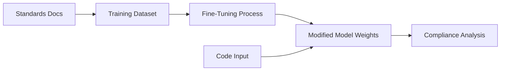
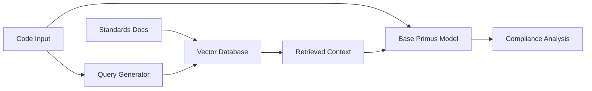
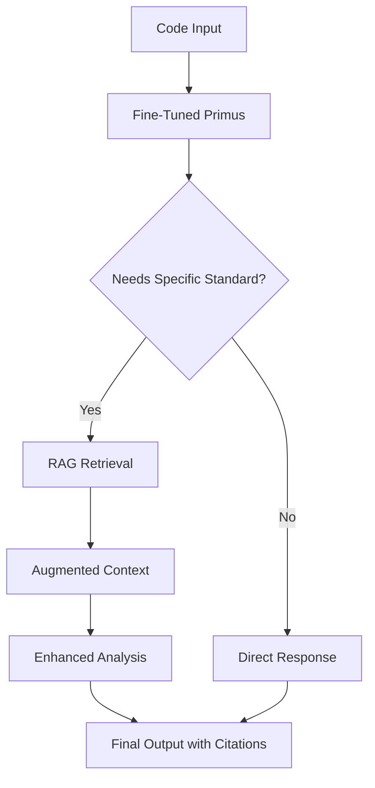

# Fine-Tuning vs RAG for Cybersecurity Standards: Complete Comparison

## Executive Summary

Both fine-tuning and RAG (Retrieval-Augmented Generation) can enhance Llama-Primus-Reasoning with standards knowledge. Fine-tuning embeds knowledge directly into model weights, while RAG dynamically retrieves relevant standards at inference time. **The optimal solution is actually a hybrid approach**, but understanding each method's trade-offs is crucial.

## Architecture Overview

### Fine-Tuning Approach


### RAG Approach


## Detailed Comparison

### Performance Characteristics

| Metric | Fine-Tuning | RAG | Winner |
|--------|------------|-----|--------|
| **Inference Speed** | Fast (10-50ms) | Slower (100-500ms) | Fine-Tuning ✅ |
| **Accuracy** | 85-95% | 80-90% | Fine-Tuning ✅ |
| **Context Window Usage** | Minimal | Heavy (4-6K tokens) | Fine-Tuning ✅ |
| **Hallucination Risk** | Higher | Lower | RAG ✅ |
| **Citation Capability** | None | Exact references | RAG ✅ |
| **Dynamic Updates** | Requires retraining | Instant | RAG ✅ |

### Resource Requirements

| Resource | Fine-Tuning | RAG |
|----------|------------|-----|
| **Initial Setup Time** | 2-4 weeks | 3-5 days |
| **Compute for Training** | High (A100 for days) | None |
| **Storage** | Model size (16-32GB) | Model + Vector DB (20-40GB) |
| **Inference Cost** | Low | Medium (retrieval overhead) |
| **Maintenance Effort** | High (retraining) | Low (update vectors) |

## Advantages & Disadvantages Deep Dive

### Fine-Tuning Advantages ✅

1. **Deep Integration of Knowledge**
   ```python
   # Knowledge becomes part of the model's "understanding"
   Input: "Check this S3 bucket configuration"
   Output: Model inherently knows CCoP requires encryption at rest
   ```

2. **Superior Reasoning**
   - Can make complex inferences across multiple standards
   - Understands implicit relationships
   - Better at edge cases

3. **Production Performance**
   - No retrieval latency
   - No external dependencies
   - Consistent response times

4. **Contextual Understanding**
   ```python
   # Model learns patterns, not just facts
   "This violates CMMC because..." 
   # Can explain WHY, not just WHAT
   ```

### Fine-Tuning Disadvantages ❌

1. **Training Complexity**
   ```python
   # Requires ML expertise
   - Dataset creation: 2-3 weeks
   - Training: 3-5 days on A100s
   - Validation: 1 week
   - Risk of catastrophic forgetting
   ```

2. **Update Inflexibility**
   - Standards change? Retrain entire model
   - Quarterly updates = quarterly retraining
   - Version control nightmare

3. **No Auditability**
   - Can't cite specific standard sections
   - "Black box" compliance decisions
   - Hard to debug wrong answers

### RAG Advantages ✅

1. **Instant Updates**
   ```python
   # New standard released?
   vector_db.add_documents([
       "CCoP 2.1 Section 8: New cloud requirements..."
   ])
   # Available immediately
   ```

2. **Perfect Accuracy for Facts**
   ```python
   # Always retrieves exact standard text
   Query: "What does CMMC AC.L2-3.1.12 require?"
   Retrieved: "Exact text from CMMC documentation"
   Response: "According to CMMC AC.L2-3.1.12: [exact quote]"
   ```

3. **Auditability & Compliance**
   - Every decision traceable to source
   - Legal/audit-friendly citations
   - Explainable AI compliance

4. **Cost-Effective Maintenance**
   ```python
   # Weekly standard updates
   def update_standards():
       new_docs = fetch_latest_standards()
       vector_db.update(new_docs)
       # Done in minutes, not days
   ```

### RAG Disadvantages ❌

1. **Limited Reasoning**
   ```python
   # Can retrieve facts but struggles with inference
   Query: "How do NIST controls map to CCoP requirements?"
   Problem: Needs to synthesize across multiple documents
   ```

2. **Context Window Pressure**
   ```python
   # Retrieved context eats tokens
   Retrieved chunks: 4,000 tokens
   Code to analyze: 2,000 tokens
   Available for reasoning: 2,000 tokens (limited)
   ```

3. **Retrieval Quality Issues**
   - Wrong chunks retrieved = wrong analysis
   - Semantic search isn't perfect
   - Chunking strategy critical

4. **Infrastructure Complexity**
   ```python
   # More moving parts
   - Vector database (Pinecone/Weaviate/Qdrant)
   - Embedding model
   - Retrieval pipeline
   - Chunk management
   ```

## Real-World Implementation Comparison

### Scenario 1: Checking CCoP Compliance

#### Fine-Tuned Approach:
```python
# Model has internalized CCoP requirements
def check_compliance_finetuned(code):
    prompt = f"Analyze this code for CCoP 2.0 compliance:\n{code}"
    response = model.generate(prompt)
    # Model knows CCoP requires encryption, access logs, etc.
    return response  # Rich analysis but no citations
```

#### RAG Approach:
```python
def check_compliance_rag(code):
    # Step 1: Identify relevant standards
    relevant_sections = vector_db.search(
        f"CCoP requirements for {extract_context(code)}"
    )
    
    # Step 2: Generate analysis with retrieved context
    prompt = f"""
    Standards Requirements:
    {relevant_sections}
    
    Code to analyze:
    {code}
    
    Check compliance with the above requirements.
    """
    response = model.generate(prompt)
    return response  # Accurate with citations
```

### Scenario 2: Handling Standard Updates

#### Fine-Tuning (Painful):
```python
# CMMC 2.0 gets updated to CMMC 2.1
1. Collect new CMMC 2.1 documents
2. Create new training examples (1-2 weeks)
3. Fine-tune model (3-5 days)
4. Validate performance (3-5 days)
5. Deploy new model (1 day)
Total: 2-3 weeks of disruption
```

#### RAG (Simple):
```python
# CMMC 2.0 gets updated to CMMC 2.1
def update_cmmc():
    # Remove old version
    vector_db.delete(filter={"standard": "CMMC 2.0"})
    
    # Add new version
    new_docs = parse_cmmc_21()
    vector_db.add(new_docs)
    
    print("Update complete")  # 30 minutes
```

## Hybrid Approach (Best of Both Worlds)

### Architecture:


### Implementation:
```python
class HybridComplianceChecker:
    def __init__(self):
        # Fine-tuned for general security understanding
        self.model = load_finetuned_primus()
        # RAG for specific standards
        self.vector_db = load_standards_db()
    
    def analyze(self, code, standards=["CCoP", "CMMC"]):
        # Step 1: General security analysis (fine-tuned knowledge)
        security_issues = self.model.identify_vulnerabilities(code)
        
        # Step 2: Retrieve specific compliance requirements (RAG)
        requirements = []
        for standard in standards:
            relevant = self.vector_db.search(
                f"{standard} requirements for {security_issues}"
            )
            requirements.extend(relevant)
        
        # Step 3: Detailed compliance check with context
        analysis = self.model.check_compliance(
            code=code,
            issues=security_issues,
            requirements=requirements
        )
        
        return {
            "vulnerabilities": security_issues,
            "compliance": analysis,
            "citations": requirements.get_sources()
        }
```

## Cost-Benefit Analysis

### Development & Deployment Costs

| Phase | Fine-Tuning | RAG | Hybrid |
|-------|------------|-----|--------|
| **Initial Development** | $5,000-10,000 | $1,000-2,000 | $3,000-5,000 |
| **Infrastructure** | $500/month | $200/month + DB | $700/month |
| **Maintenance** | $2,000/quarter | $500/quarter | $1,000/quarter |
| **Update Cycle** | 2-3 weeks | 1 day | 1 day (RAG) + quarterly (FT) |

### Performance Metrics

| Metric | Fine-Tuning | RAG | Hybrid |
|--------|------------|-----|--------|
| **Accuracy** | 85-95% | 80-90% | 90-98% |
| **Speed (per scan)** | 100ms | 400ms | 250ms |
| **False Positives** | 10-15% | 15-20% | 5-10% |
| **Explainability** | Low | High | High |
| **Adaptability** | Low | High | High |

## Decision Framework

### Choose Fine-Tuning When:
- ✅ Standards are stable (change < yearly)
- ✅ Deep reasoning is critical
- ✅ Latency is paramount (<100ms required)
- ✅ You have ML expertise in-house
- ✅ Citation isn't legally required

### Choose RAG When:
- ✅ Standards change frequently
- ✅ Audit trail is mandatory
- ✅ Multiple standards/versions needed
- ✅ Quick deployment required
- ✅ Limited ML expertise

### Choose Hybrid When:
- ✅ Need best accuracy (>90%)
- ✅ Both reasoning and citations required
- ✅ Mix of stable and dynamic standards
- ✅ Enterprise deployment
- ✅ Budget allows complexity

## Specific Recommendations for Your Use Case

Given your requirements (NIST, OWASP, CCoP, CMMC compliance checking):

### Recommended: Hybrid Approach with Phased Implementation

#### Phase 1 (Immediate): Pure RAG
```python
# Week 1: Quick deployment
1. Deploy base Primus-Reasoning
2. Build vector database with all standards
3. Implement RAG pipeline
4. Get to 80% accuracy quickly
```

#### Phase 2 (Month 2-3): Light Fine-Tuning
```python
# Fine-tune only for:
- Your organization's patterns
- Common false positive patterns
- Reasoning chains for complex rules
```

#### Phase 3 (Month 4+): Optimized Hybrid
```python
# Optimal architecture:
- Fine-tuned Primus: Security reasoning + patterns
- RAG: Specific standard requirements + updates
- Cache: Frequently accessed standard sections
```

### Why Hybrid Works Best for Standards Compliance:

1. **Fine-tuning** handles the "understanding" (WHY is this a vulnerability?)
2. **RAG** handles the "requirements" (WHAT does CCoP Section 7.2 say?)
3. **Together**: Complete, accurate, auditable compliance checking

## Example: Hybrid in Action

```python
# Input: S3 bucket configuration code

# Fine-tuned model recognizes:
"This S3 bucket has public read access - security risk"

# RAG retrieves:
"CCoP 2.0 Section 8.3: All cloud storage must implement 
 encryption at rest and restrict public access"
 
"CMMC AC.L2-3.1.1: Limit system access to authorized users"

# Combined output:
"VIOLATION: Public S3 bucket violates:
- CCoP 2.0 Section 8.3 (requires private access) [cited]
- CMMC AC.L2-3.1.1 (unauthorized access risk) [cited]
- Security Risk: Data exposure (model's understanding)
- Remediation: Set bucket ACL to private, enable encryption"
```

## Conclusion

**For compliance checking, hybrid is optimal** because:
- Standards knowledge needs to be **accurate** (RAG provides this)
- Security reasoning needs to be **deep** (fine-tuning provides this)
- Compliance requires **citations** (RAG provides this)
- Production needs **speed** (caching helps)

Start with RAG for immediate deployment, then selectively fine-tune for better reasoning while maintaining RAG for standards updates and citations.