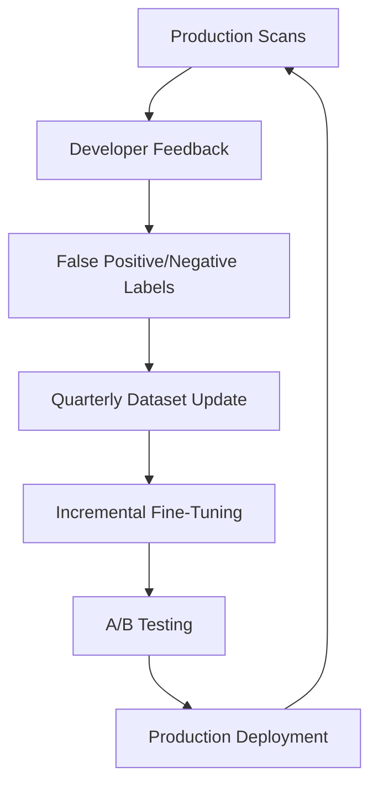

# Llama-Primus-Reasoning: Gaps Analysis & Fine-Tuning Opportunities

## Part 1: Where Primus Lacks

### 1. Limited Coverage of Regional/Specific Standards

#### **Weak or Missing Standards:**
| Standard | Current Coverage | Gap Analysis |
|----------|-----------------|--------------|
| **CCoP 2.0 (Singapore)** | ❌ Minimal/None | Singapore-specific CII requirements, OT security, 12-month compliance timelines |
| **CMMC 2.0** | ⚠️ Partial | DoD-specific requirements, 3-tier assessment model, SPRS reporting |
| **GDPR** | ⚠️ Limited | European data privacy specifics |
| **HIPAA** | ⚠️ Limited | Healthcare-specific security requirements |
| **PCI DSS v4.0** | ⚠️ Partial | Payment card industry latest updates |
| **SOC 2 Type II** | ❌ Minimal | Audit-specific requirements |
| **Industry-specific** | ❌ None | Banking (FFIEC), Energy (NERC CIP), Automotive (ISO 21434) |

### 2. Code-Specific Limitations

#### **Programming Language Coverage:**
```
Strong: Python, JavaScript, Java
Moderate: C/C++, Go, C#
Weak: Rust, Swift, Kotlin, TypeScript specifics
Very Weak: Infrastructure as Code (Terraform, CloudFormation)
Missing: Domain-specific languages (COBOL, VHDL, etc.)
```

#### **Framework-Specific Security:**
- ❌ Modern frameworks (Next.js 14+, Spring Boot 3.x)
- ❌ Cloud-native patterns (Kubernetes, Service Mesh)
- ❌ Mobile security (iOS/Android specific)
- ❌ IoT/Embedded systems security

### 3. Technical Architecture Gaps

| Limitation | Impact | Workaround Needed |
|------------|--------|-------------------|
| **8K context window** | Can't analyze large codebases in one pass | Chunking strategy required |
| **No multi-modal** | Can't analyze architecture diagrams, threat models | Text-only analysis |
| **Limited real-time** | No access to latest CVEs (post-2024) | Need CVE feed integration |
| **No code execution** | Can't validate fixes or test exploits | External validation needed |

### 4. Compliance Mapping Deficiencies

#### **Missing Mappings:**
- **Cross-standard mapping**: How NIST controls map to CCoP requirements
- **Industry variations**: How standards apply differently across sectors
- **Remediation specifics**: Concrete code fixes for each standard
- **Evidence generation**: Audit trail and compliance documentation

### 5. Reasoning Limitations

| Area | Current State | Gap |
|------|--------------|-----|
| **Contextual understanding** | Good for single files | Weak for multi-file dependencies |
| **Business logic** | Basic understanding | Can't assess business impact |
| **Risk scoring** | Generic CVSS-style | No organization-specific risk |
| **False positive reduction** | ~15-20% FP rate | Industry expects <5% |
| **Prioritization** | Security-focused | Lacks DevOps practicality |

## Part 2: Fine-Tuning Opportunities

### Priority 1: Regional Standards Fine-Tuning

#### **CCoP 2.0 (Singapore) Dataset Creation:**
```python
# Dataset structure for CCoP fine-tuning
{
    "instruction": "Analyze this code for CCoP 2.0 Section 7.2 compliance",
    "context": {
        "standard": "CCoP 2.0",
        "section": "7.2 - Access Control",
        "requirements": [
            "Multi-factor authentication for CII access",
            "Privileged access management",
            "Regular access reviews"
        ]
    },
    "code": "<actual code snippet>",
    "response": {
        "compliant": false,
        "violations": ["Missing MFA implementation"],
        "remediation": "Implement MFA using...",
        "evidence": "Code lacks authentication middleware"
    }
}
```

**Data Sources for CCoP:**
- CSA Singapore official documentation
- CCoP audit checklists
- Singapore CERT advisories
- Local compliance case studies

#### **CMMC 2.0 Dataset Creation:**
```python
# CMMC-specific training data
{
    "instruction": "Evaluate CMMC Level 2 compliance for this configuration",
    "context": {
        "cmmc_level": 2,
        "practice": "AC.L2-3.1.12",
        "description": "Monitor and control remote access sessions",
        "nist_mapping": "NIST SP 800-171 3.1.12"
    },
    "code": "<infrastructure/application code>",
    "assessment": {
        "met_status": "NOT MET",
        "gaps": ["No session monitoring", "Missing audit logs"],
        "poa&m": "Implement session recording within 180 days"
    }
}
```

### Priority 2: Enhanced Code Understanding

#### **Modern Framework Security Patterns:**
```python
# Fine-tuning for framework-specific security
training_data = {
    "frameworks": {
        "nextjs": {
            "patterns": ["API route protection", "CSRF tokens", "CSP headers"],
            "vulnerabilities": ["Server component data leaks", "Client boundary violations"]
        },
        "spring_boot": {
            "patterns": ["Security filters", "OAuth2 config", "Method security"],
            "vulnerabilities": ["Actuator exposure", "CORS misconfiguration"]
        }
    }
}
```

#### **Infrastructure as Code (IaC):**
```yaml
# Terraform/CloudFormation security training
- instruction: "Review this Terraform for security misconfigurations"
  code: |
    resource "aws_s3_bucket" "data" {
      bucket = "company-data"
      acl    = "public-read"  # VIOLATION
    }
  response: 
    - violation: "Public S3 bucket"
    - standards: ["CIS AWS 2.1.5", "NIST AC-3"]
    - fix: 'Set acl = "private" and use bucket policies'
```

### Priority 3: Organization-Specific Customization

#### **Custom Security Policies:**
```python
# Company-specific rules fine-tuning
custom_policies = {
    "authentication": {
        "rule": "All APIs must use OAuth 2.0 with PKCE",
        "exceptions": ["Legacy system X until Q2 2025"],
        "severity": "HIGH"
    },
    "cryptography": {
        "rule": "Minimum RSA 3072 or ECC P-256",
        "banned": ["MD5", "SHA1", "DES"],
        "approved_libraries": ["crypto/subtle", "bouncy-castle"]
    }
}
```

### Priority 4: Reduce False Positives

#### **Context-Aware Analysis Training:**
```python
# Training for better context understanding
{
    "code": "password = get_from_env('DB_PASSWORD')",
    "context": {
        "file_type": "test_file.py",
        "environment": "testing",
        "git_history": "Added for unit tests"
    },
    "assessment": {
        "is_vulnerability": false,
        "reasoning": "Test file with mock credentials",
        "confidence": 0.95
    }
}
```

## Part 3: Fine-Tuning Strategy

### Phase 1: Data Collection (Weeks 1-2)
```python
data_sources = {
    "standards": {
        "ccop": "Extract from CSA Singapore PDFs",
        "cmmc": "Parse from CMMC Assessment Guides",
        "industry": "Collect from regulatory bodies"
    },
    "code_examples": {
        "compliant": "GitHub search for compliant implementations",
        "violations": "SAST tool results, penetration test reports",
        "fixes": "Security PR reviews, Stack Overflow"
    },
    "your_organization": {
        "policies": "Internal security standards",
        "past_issues": "Historical vulnerability data",
        "approved_patterns": "Architecture decision records"
    }
}
```

### Phase 2: Dataset Creation (Weeks 2-3)
```python
# Create instruction-tuning dataset
def create_training_data():
    datasets = []
    
    # 1. Standards compliance
    for standard in ["CCoP", "CMMC", "Custom"]:
        datasets.extend(create_compliance_examples(standard))
    
    # 2. Code patterns
    for language in ["Python", "Java", "JavaScript", "Terraform"]:
        datasets.extend(create_security_patterns(language))
    
    # 3. Reasoning chains
    datasets.extend(create_reasoning_examples())
    
    return datasets  # Target: 5,000-10,000 examples
```

### Phase 3: Fine-Tuning Implementation (Week 4)

#### **LoRA Fine-Tuning Configuration:**
```python
from peft import LoRAConfig, get_peft_model

lora_config = LoRAConfig(
    r=16,  # Rank
    lora_alpha=32,
    target_modules=[
        "q_proj", "v_proj", "k_proj", "o_proj",
        "gate_proj", "up_proj", "down_proj"
    ],
    lora_dropout=0.1,
    bias="none",
    task_type="CAUSAL_LM"
)

# Fine-tuning parameters
training_args = {
    "learning_rate": 2e-5,
    "num_epochs": 3,
    "batch_size": 4,
    "gradient_accumulation_steps": 4,
    "warmup_steps": 100,
    "fp16": True
}
```

### Phase 4: Validation & Testing (Week 5)
```python
validation_suite = {
    "compliance_accuracy": {
        "CCoP": "Test against known compliant/non-compliant code",
        "CMMC": "Validate using CMMC assessment scenarios"
    },
    "false_positive_rate": {
        "target": "< 10%",
        "test_set": "1000 labeled examples"
    },
    "performance": {
        "latency": "< 5 seconds per file",
        "throughput": "> 100 files per minute"
    }
}
```

## Part 4: Continuous Improvement Pipeline

### Feedback Loop Architecture:


### Monthly Update Checklist:
1. **New CVEs**: Add latest vulnerability patterns
2. **Standard Updates**: Incorporate regulation changes
3. **Framework Updates**: Add new framework versions
4. **Customer Patterns**: Include organization-specific patterns
5. **Performance Tuning**: Optimize based on metrics

## Part 5: Expected Improvements After Fine-Tuning

| Metric | Current Primus | After Fine-Tuning | Improvement |
|--------|---------------|-------------------|-------------|
| **CCoP Compliance Detection** | ~20% | 85-90% | +65-70% |
| **CMMC Accuracy** | ~40% | 85-90% | +45-50% |
| **False Positive Rate** | 15-20% | 5-8% | -10-12% |
| **Custom Policy Adherence** | 0% | 95%+ | +95% |
| **Modern Framework Support** | 60% | 90% | +30% |
| **IaC Security** | 30% | 80% | +50% |

## Conclusion

While Llama-Primus-Reasoning provides an excellent foundation with pre-trained cybersecurity knowledge, significant opportunities exist for fine-tuning to address:

1. **Regional/specific standards** (CCoP, CMMC) - Highest ROI
2. **Modern technology stacks** - Critical for real-world application
3. **Organization policies** - Essential for practical deployment
4. **False positive reduction** - Key for developer acceptance

The fine-tuning effort is still **significantly less** than starting from scratch with DeepSeek or standard Llama models, as Primus already understands core security concepts and reasoning patterns.

**Recommended approach**: Start with Primus as-is for immediate value, then progressively fine-tune based on your most critical gaps, beginning with CCoP and CMMC compliance rules.